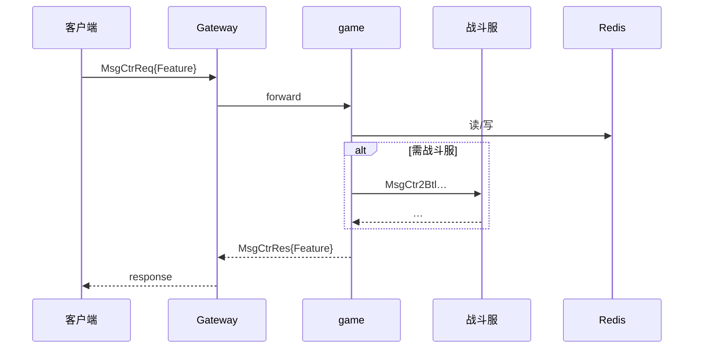
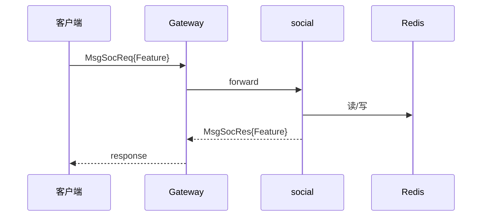
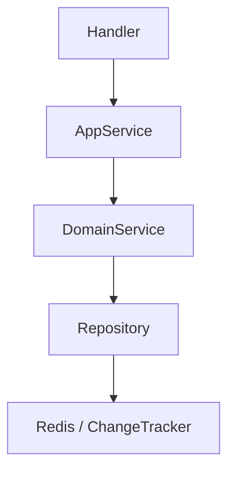

# 服务器需求文档生成规则

**用户输入**：功能名（如 `J-绝学`、`Z-装备设计文档 林秉捷`）或指定文档路径（如 `docs/developdoc/J-绝学/服务器需求.md`）。策划需求从 `docs/developdoc/{功能名}/` 目录读取。

## 文档适用范围

**本规则文档面向服务端（game / social / battle-proxy / login）逻辑开发的技术问题**，与 [`docs/design/server/`](docs/design/server/) 下已落地的服务器需求文档口径一致。

- **适用范围**：
  - ✅ **game（中心服 CtrSvr）**：业务逻辑、与客户端的 `MsgCtr*` 协议、与战斗服的 `MsgCtr2Btl*` 协议、DDD、Redis、错误码与日志
  - ✅ **social（社交服 SocSvr）**：`MsgSoc*` 协议、好友/邮件等社交域持久化与推送、与 game 的协同（如在线同步、功能开放 Gate）
  - ✅ **battle-proxy（战斗地图管理等）**：与战斗实例、地图生命周期相关的服务端需求（以仓库既有 `srv/` 结构为准）
  - ✅ **login**：会话、创角等与登录服相关的协同需求（若功能跨 login，须在影响范围中写明）

- **服务归属判定（生成文档时必须先写清）**：

| 客户端消息前缀 | 典型 proto 文件 | 主落地服务 |
|----------------|-----------------|-----------|
| `MsgCtrReq` / `MsgCtrRes` / `MsgCtrNtf` | `proto/CtrSvr.proto` | **game**（经 Gateway → game） |
| `MsgSocReq` / `MsgSocRes` / `MsgSocNtf` | `proto/SocSvr.proto` | **social**（经 Gateway → social） |
| `MsgCtr2Btl*` 等 | `proto/Ctr2BtlSvr.proto` 等 | **game** 与战斗服协同（具体以 proto 注释为准） |

- **不适用范围**：
  - ❌ 战斗服（Battle Server）**内部**战斗演算与地图逻辑细节（另有规范；需求文档只写 game 侧如何进图、结算、镜像等）
  - ❌ 客户端（Client）实现与前端 UI
  - ❌ 纯策划案排版（本命令产出为**技术向**服务器需求）

- **说明**：
  - 文档中可涉及客户端、Gateway、game、social、battle-proxy、Redis；**叙述视角随主落地服务切换**（例如好友主流程以 social 为主，game 仅写协同边界）
  - 策划文案中的「中心服玩家维度」等术语，可能对应 **game 玩家 Guid** 或 **social 侧社交数据**，须在 SR-1 可选「范围与术语映射」中写清，避免默认全部落在 game

## 文档目标

本规则文档用于生成**服务器需求文档**，目标包括：

1. **指导开发人员**：明确如何在对应服务（game/social/…）内做技术设计，产出与 [`docs/design/server/`](docs/design/server/) 可对照的需求文档
2. **指导AI开发**：按本规则生成/增量修订服务器需求文档，减少与实现脱节
3. **统一设计标准**：DDD、协议归属、Redis/持久化、错误码段位等与仓库规范一致
4. **提高设计效率**：模板化 SR-1～SR-4，按需扩展 SR-5、附录与流程图

## 文档生成流程

**⚠️ 重要：本命令（requirement）仅负责服务器需求文档，不负责开发文档。**

```
步骤1：输入准备
    ↓
步骤2：生成服务器需求文档 *(mandatory)*
    ↓
步骤3：服务器需求文档自检与用户复核 *(mandatory)*
    ↓ (AI 输出自检结论；用户确认需求可作为 development 输入后，可将状态改为 Reviewed)
    ↓
【本命令结束】用户需单独使用 development 命令生成开发文档
```

**本命令职责边界**：
- ✅ **本命令仅生成服务器需求文档**：执行 requirement 命令时，只完成步骤 1～3，输出服务器需求文档
- ✅ **本命令不生成开发文档**：若用户同屏提及开发文档，应提示其**另开一轮**使用 `.cursor/commands/development.md`；本命令仍以需求文档为主交付物
- ✅ **服务器需求文档是开发文档的输入**：进入 development 前，应有一份经自检、用户认可的需求文档（不要求形式化「审批流」）

**关键要求**：
- ✅ **须完成步骤 3 自检**：AI 按「自检清单」逐项给出结论（通过/待补/不适用），用户复核要点可勾选确认
- ✅ **用户确认后再进开发**：建议用户在元信息将状态从 `Draft` 改为 `Reviewed` 后再调用 development（避免未对齐的需求直接编码）
- ❌ **不跳过步骤 3**：不可省略自检与复核说明（可与用户口头确认等价，但须在对话或文档中留下要点）

**后续步骤（由用户主动触发）**：
- 用户确认需求后，**单独使用** `.cursor/commands/development.md`（development 命令）生成开发文档

## 步骤1：输入准备

### 用户输入格式

用户可通过以下两种方式提供需求来源：

| 输入方式 | 示例 | 说明 |
|----------|------|------|
| **功能名** | `J-绝学`、`Z-装备设计文档 林秉捷`、`S-商店` | 读取 `docs/developdoc/{功能名}/` 下对应文档 |
| **指定文档路径** | `docs/developdoc/J-绝学/服务器需求.md` | 直接读取指定路径的文档 |

### 策划文档目录结构（docs/developdoc）

| 目录 | 说明 |
|------|------|
| `docs/developdoc/策划原文/` | **策划原文档**：Excel 转 Markdown 的原始策划文档，如 `J-绝学.md`、`Z-装备设计文档 林秉捷.md` |
| `docs/developdoc/{功能名}/` | **整理后需求**：由 svn-doc-sync 需求整理步骤提取的服务器需求，含 `服务器需求.md`、`配置表结构.md`、`变更记录.md` |

### 策划文档读取规则

**当用户输入功能名时**，按以下优先级读取：

| 优先级 | 路径 | 用途 |
|--------|------|------|
| 1 | `docs/developdoc/{功能名}/服务器需求.md` | **必读**：精简版服务器业务需求（功能点、主流程、关键配置、存储维度） |
| 2 | `docs/developdoc/{功能名}/配置表结构.md` | **推荐**：配置表字段定义，便于协议与存储设计 |
| 3 | `docs/developdoc/{功能名}/变更记录.md` | **可选**：需求变更历史，确认最新变更 |
| 4 | `docs/developdoc/策划原文/{功能名}.md` | **补充/兜底**：当 `{功能名}/` 目录不存在或需核对原文时，读取策划原文档 |

**路径约定**：
- 功能名与目录/文件名一致（如 `J-绝学`、`Z-装备设计文档 林秉捷`）
- `策划原文/` 下含 `待审核/`、`历史文档/` 子目录，优先读取根目录下的 `{功能名}.md`

**当用户指定文档路径时**：直接读取该路径，不再按功能名推导。

### 输入准备检查清单

- [ ] 已读取 `docs/developdoc/{功能名}/服务器需求.md`（或用户指定文档）；若不存在则读取 `docs/developdoc/策划原文/{功能名}.md`
- [ ] 已确定涉及的领域和子域
- [ ] 已查找 `docs/design/server/` 下是否已有该功能的服务器需求文档（若有，进入步骤 2 修订或步骤 3 自检与增量对齐）

## 步骤2：生成服务器需求文档 *(mandatory)*

**必须先生成服务器需求文档，包含以下内容：**

- **业务概述** *(mandatory)*：业务背景、业务价值、影响范围
- **DDD架构设计** *(mandatory)*：涉及的领域、使用的设计模式、新增/调整的文件和目录、领域实体和服务
- **协议设计** *(mandatory)*：Protobuf协议定义、消息结构、消息流向、业务流程图
- **数据存储设计** *(mandatory)*：Redis存储设计（Key格式、数据结构、存储内容、存储策略）

**保存路径**：`docs/design/server/{系统名称}/{系统名称}-服务器需求.md`（文件名可与目录内既有文档对齐，如 `江湖宗师殿-服务器需求.md`）

**命名建议**：`{系统名称}` 与 `docs/design/server/` 下目录名一致；跨多服务时在元信息「涉及服务」中列全，不必为每个服务各建一份需求，除非团队约定拆分。

**文档结构**：按照本规则文档「服务器需求文档内容」章节的结构生成；**SR-5、附录为推荐**，复杂系统（如 K-矿场）建议补齐。

**生成后状态**：文档元信息中状态默认为 `Draft`；用户复核认可后可改为 `Reviewed`（见步骤 3）。

## 步骤3：服务器需求文档自检与用户复核 *(mandatory)*

**目的**：用可执行的检查项收敛「初稿与实现差距过大」的问题；**不强制**填写审核人、审核日期或四态审批流。

### AI 自检清单（硬约束，≤12 项）

生成或修订需求文档后，AI 须逐项给出 **通过 / 待补 / 不适用** 结论（可在对话中简述，关键项写入文档「附录」或自检表）：

1. **服务归属**：主落地为 game / social / battle-proxy / login 是否写明？`MsgCtr*` vs `MsgSoc*` 是否与 proto 一致？
2. **数据归属（玩家维度 / 角色维度）**：SR-1 或 SR-4 是否显式声明？Redis 前缀、`Load` 参数、流程描述是否同一套主键、无混用？
3. **DDD 分层**：领域 / 应用 / 基础设施边界是否清晰？跨子域是否「需要方定义接口 + 本子域 `infrastructure` 适配」？
4. **持久化路径**：玩家个人数据是否走 `server/common/persist`（`PersistableEntity` + `MarkModified` / `MarkDeletedByKey` + ChangeTracker）？是否写明禁止业务侧绕过 ChangeTracker 直连 `SaveData`/`DeleteData`（计数器类 Key 等例外须在文中标注）？
5. **Redis Key**：是否在 `srv/{主服务}/domain/{subdomain}/entity/storage/key_constants.go`（及 `GetRedisKey()`）约定？无仓储层硬编码拼接？
6. **Storage 与 proto**：每个需序列化落 Redis 的结构是否对应仓库内 **实际** `MsgData*Storage`（或等价）定义位置？新增消息清单是否列出？**具体文件路径以仓库为准**（game 常见 `proto/share/storage.proto`；social 等以服务内 share proto 为准）。
7. **错误码**：是否在 `proto/EMsgError.proto`（或项目实际错误码 proto）中占用**独立号段**，命名与注释可读？新增前检索避免冲突。
8. **协议与推送**：请求/响应/推送是否列全？推送是否标明 `MsgCtrNtf*` 或 `MsgSocNtf*` 及触发时机？若复用既有消息须写明不复用新造的原因。
9. **配置对齐**：关键数值/消耗/条件是否挂钩 `excel/csv` 或 `docs/developdoc/.../配置表结构.md`？缺失配置是否单列清单？
10. **流程图**：是否至少有 **1 张** 覆盖主链路（客户端→Gateway→主服务→Redis/协同）？战斗、异步结算、复杂时序则按需追加（不要求凑满三张）。
11. **设计模式**：SR-2 是否说明所用模式、原因、**相对 `srv/{服务}/` 的路径**（避免只有抽象描述）？
12. **无实现伪代码**：需求文档不写大段业务伪代码；算法与公式可写「配置来源 + 文字步骤」。

### 用户复核要点（建议勾选，非全表）

| 类别 | 复核要点 |
|------|----------|
| **业务** | 与策划/澄清结论一致；边界（不做什么）已写 |
| **协议** | 消息名完整；与 `qa/api` 或 proto 规划一致；跨服字段（如 ServerId）已约定 |
| **存储** | 公有数据 TTL/并发/索引；大 Key 是否拆分 |
| **配置** | 表名、行含义、与 SR-5（若有）一致 |

用户确认后，可将元信息 **状态** 更新为 `Reviewed`，并可选记录「复核日期/备注」一行（非必填）。

## 基础知识

### 服务端开发重点

按**主落地服务**选择叙述视角（可多选协同，但须指定一个「主编排」服务）：

| 服务 | 文档应写清的内容 |
|------|------------------|
| **game** | `MsgCtr*` 入出口、Handler→AppService→Domain、Redis、与战斗服/ social 的端口调用 |
| **social** | `MsgSoc*`、好友/邮件等聚合与 Key、与 game 的数据同步或 RPC 边界、FeatureOpenGate（若不经 game Router） |
| **battle-proxy** | 地图/实例生命周期、与 game 的协议与责任切分 |
| **login** | 会话、创角等与登录链路的接口与约束 |

**存储**：game、social 等玩家业务数据以 **Redis** 为主（不用 MySQL 作业务库）；具体持久化 API 以 `server/common/persist` 与各领域 README 为准。

### 输入要求

- **策划文档优先**：用户输入功能名（如 `J-绝学`）时，**必须**从 `docs/developdoc/{功能名}/服务器需求.md` 读取需求；若不存在则从 `docs/developdoc/策划原文/{功能名}.md` 读取策划原文档；或用户指定文档路径直接读取
- **策划原文档目录**：`docs/developdoc/策划原文/` 存放 Excel 转 Markdown 的原始策划文档
- 项目基于 DDD 架构进行开发，如果用户描述中没有明确领域，需要提示用户指定领域
- **重点**：确定功能落在 **哪个服务**（game / social / …）的哪个有界上下文与子域；跨服务时在影响范围中分别列出职责
- **策划文档特点**：
  - **策划文档是多个功能点的集合**：一个策划文档可能包含多个功能点，每个功能点都有自己的需求
  - **功能点拆分**：生成开发文档时，需要将策划文档拆分为多个功能点，每个功能点单独设计
  - **功能点关联**：如果多个功能点属于同一个系统，可以在同一个开发文档中描述，但需要明确区分每个功能点的需求
  - **功能点独立性**：每个功能点应该有独立的业务规则、配置需求、协议设计等

### 协议文件

| 用途 | proto 文件（以仓库为准） |
|------|-------------------------|
| 客户端 ↔ **game**（`MsgCtr*`） | `proto/CtrSvr.proto` |
| 客户端 ↔ **social**（`MsgSoc*`） | `proto/SocSvr.proto` |
| **game** ↔ 战斗服等 | `proto/Ctr2BtlSvr.proto` 等（见文件内注释） |
| **错误码**（Ctr/Soc 共用枚举时） | `proto/EMsgError.proto`（若项目另有拆分，以实际文件为准） |

### 流程图规范

- **参考规范**：详细流程图绘制规范请参考 `docs/dev/guide/文档建议.md` 中的「流程图规范」章节
- **工具**：使用 Mermaid 语法绘制流程图
- **最低要求**：至少 **1 张** 能覆盖**主链路**的流程图或时序图（参与者须含：客户端、Gateway、**主服务**、Redis 或协同方之一）
- **按需追加**（不必凑数）：
  - 涉及战斗进图/结算：客户端 → game → 战斗服 → Redis 的时序或分支
  - 复杂领域调用：Handler → AppService → Domain → Repository 的调用链
  - 异步推送、跨服：单独小节标注推送名与触发点

### Redis存储规范

**参考规范**：详细的 Redis Key 命名规范请参考 `.cursor/rules/storage.mdc`。

**数据分类原则（核心）**：
- **玩家个人数据**（内存 + Redis）：私有属性（等级、次数、锻造度等），登录加载到内存，ChangeTracker 定时持久化
- **公有数据**（仅 Redis）：跨玩家可见数据（会话、记录、镜像等），直接读写 Redis，支持 pattern 查询，通常带 TTL

**功能数据归属：玩家维度 vs 角色维度（强制声明）**：

以 **game** 为例，「玩家个人数据」还须再区分**主键是账号级玩家还是游戏内角色**，设计与文档必须一致，**禁止混用**。（**social** 侧若策划仍称「玩家维度」，须在 SR-1 术语映射中写明对应 `PlayerGuid` / 存储前缀，勿与 game 角色 ID 混写。）

| 归属 | 主键含义 | 多角色账号下的数据 | Redis 前缀惯例 | storage / 仓储 |
|------|----------|-------------------|----------------|----------------|
| **玩家维度** | 玩家 Guid（`playerID` / `playerGuid`，game 侧账号级） | **全账号共享一套** | `player:{玩家ID}:...` | `MsgData*Storage` 中归属字段语义为 **PlayerId（玩家 Guid）**；`Load/Save(ctx, playerID)` |
| **角色维度** | 游戏内角色 ID（`playerRoleId` / `RoleID`） | **每角色一套** | `playerrole:{角色ID}:...` | 归属字段语义为 **角色 ID**；`Load/Save(ctx, roleID)` |

**文档与实现要求**：
- **服务器需求文档**：在 **SR-1（影响范围）** 或 **SR-4（数据分类表）** 中须**显式写明**本功能是「**玩家维度**」还是「**角色维度**」；策划原文未写清时，须列出**待策划确认项**，**禁止**默认按角色维度落 Redis / 写 proto。
- **Handler / 应用层**：玩家维度功能只从上下文解析 **玩家 ID**；**禁止**用 `GetRoleIDList()[0]`、主角色映射等把玩家数据挂到角色 ID 上。
- **全局下发数据**：若数据随登录/账号下发且语义为玩家级（如全局属性树），需求文档须写清归属**玩家**；编排可放在玩家应用服务/玩家领域，子域（如宠物）可提供计算或加载能力，但**主键仍须是玩家 Guid**。

**基本原则**：
- **各子域自管**：Redis Key 格式在各自子域 **`srv/{主服务}/domain/{subdomain}/entity/storage/`** 内定义（`{主服务}` 如 `game`、`social`）
- **符合 DDD**：领域层持有 Key 格式知识，基础设施层通过 `PersistableEntity.GetRedisKey()` 获取
- **禁止硬编码**：不在仓储或基础设施层拼字符串

**Key命名格式**：
- **格式规则**：`{前缀}:{主体ID}:{功能}:{功能ID} = value`
- **前缀规范**：
  - `playerrole:` - 角色相关（玩家个人）：`playerrole:{角色ID}:{功能}:{功能ID}`
  - `player:` - 玩家相关（玩家个人）：`player:{玩家ID}:{功能}`
  - `{功能名}:` - 公有数据（跨玩家可见）：`{功能}:{playerId}:{uniqueId}`

**禁止事项**：
- ❌ **禁止硬编码**：Key 格式必须在 `srv/{主服务}/domain/{subdomain}/entity/storage/key_constants.go` 中定义
- ❌ **禁止跨子域共享 Key**：不同子域的 Redis Key 各自定义
- ❌ **禁止业务侧绕过 ChangeTracker**：见下节「持久化基础设施」

### 持久化基础设施（强制）

- 玩家个人类等需纳入全局变更跟踪的数据，应通过 **`server/common/persist`**：**`PersistableEntity`** + **`persist.MarkModified` / `MarkDeletedByKey`**，由 **ChangeTracker** 批量提交 Redis；进程启动处按各服务惯例 **`persist.RegisterStore`**（与仓库内 `docs/design/server/Y-邮件系统/Y-邮件系统-服务器需求.md` 等已落地文档一致）。
- **禁止**为同一类业务数据再写一套绕过 ChangeTracker 的直连 `SaveData`/`DeleteData` 路径；**例外**（须在需求中写明）：全局 INCR 计数器、纯 TTL 临时索引键等无 `PersistableEntity` 承载的辅助 Key。
- **公有数据**：可按场景 `SETEX` 或与 ChangeTracker 组合；仍须避免在领域核心逻辑中散落裸 Redis 字符串拼接。

### 配置文件

- **配置路径**：`excel/`
- **配置要求**：
  - 开发文档需要依赖策划文档生成，所以要先导入新增配置内容
  - 策划文档中必须提供配置内容，如果没有，提示用户补充策划文档
  - 所有参数都应该来源于配置文档，不能在代码中写死参数
  - **如果需要的参数没有配置，须在需求文档（SR-5 或附录）列出缺失配置清单**，开发阶段再在开发文档中同步
  - 需要的配置在配置表中没有，可以在领域内增加一个配置文件，临时进行配置，后期进行替换

### DDD架构规范

- **参考规范**：详细的 DDD 架构规范请参考 `.cursor/rules/ddd-architecture.md` 或 `ddd-architecture.mdc`（以仓库为准）
- **文档要求**：在服务器需求文档中描述DDD架构设计，包括：
  - 涉及的领域和子域
  - 使用的设计模式（参考上述 ddd-architecture 文档）
  - 新增/调整的文件和目录
  - 领域实体和服务

### 协议文件规范

- 参考已有协议文件中的规范，新增协议
- 遵循项目协议命名和结构规范

### 文档保存路径

#### 服务器需求文档

- **保存路径**：`docs/design/server/{系统名称}/{系统名称}-服务器需求.md`
- **示例**：`docs/design/server/J-江湖宗师殿/江湖宗师殿-服务器需求.md`

## 服务器需求文档内容

**服务器需求文档包含以下章节：**

**文档元信息模板**（必须放在文档开头）：

```markdown
## 文档元信息

- **功能名称**：`[功能名称]`
- **创建日期**：`[日期]`
- **最后更新**：`[日期]`
- **状态**：`Draft`（初稿） / `Reviewed`（用户已复核，可作为 development 输入）
- **输入来源**：`docs/developdoc/{功能名}/服务器需求.md` / `docs/design/server/...` 增量修订 / 用户指定文档 / 用户描述：`"[描述内容]"`
- **涉及领域**：`[有界上下文，如 game、social、login 等]`
- **涉及服务**：`game` / `social` / `battle-proxy` / `login`（多选；须与协议前缀、目录树一致）
- **复核备注**（可选）：`[用户确认要点、评审结论链接等]`
```

**注意**：
- 新建时状态默认为 `Draft`
- 用户完成「步骤3 复核」后，将状态改为 `Reviewed`；**不再使用** `In Review` / `Approved` / `Rejected` 等形式化审批态

### SR-1. 业务概述 *(mandatory)*

- **业务背景**：描述业务背景和需求来源
- **业务价值**：描述该功能带来的业务价值
- **影响范围**：描述影响的模块、领域、系统等（**跨 game/social 时须分栏写清各自职责**，避免默认全在 game）
- **数据归属（推荐与 SR-4 一致）**：一句话写明本功能持久化数据是 **玩家维度**（玩家 Guid，全账号共享）还是 **角色维度**（角色 ID，每角色一套）；未在策划侧明确时，列出待确认项
- **范围与术语映射**（*推荐*）：策划用语 ↔ 实际服务/子域/协议前缀（例：「中心服玩家维度」可能指 social 侧 `PlayerGuid` 存储；见 `docs/design/server/H-好友/H-好友-服务器需求.md` 开篇写法）

### SR-2. DDD架构设计 *(mandatory)*

基于 `.cursor/rules/ddd-architecture.md`（或 `.cursor/rules/ddd-architecture.mdc`，以仓库为准）规范，描述架构调整。**须显式说明**玩家个人数据是否走 `server/common/persist` + ChangeTracker（与「基础知识 → 持久化基础设施」一致）。

#### 涉及的领域

- **主领域**：`[领域名称，如 game、social、login]`
- **子域**：`[子域名称，如 user/account/player/battle]`
- **共享内核**：`[如果涉及 Shared Kernel，说明共享的实体或接口]`

#### 使用的设计模式 *(mandatory)*

**必须说明代码开发过程中使用的设计模式**。虽然整体架构是DDD，但业务开发中也会使用设计模式。

**参考规范**：详细的设计模式说明请参考 `.cursor/rules/ddd-architecture.md`（或 `ddd-architecture.mdc`）中的「设计模式」章节。

**在服务器需求文档中，必须明确说明**：

- **使用的设计模式**：列出功能开发中使用的所有设计模式（如Repository、Factory、依赖注入等）
- **使用原因**：说明为什么使用该设计模式
- **使用位置**：说明设计模式在代码中的具体位置（文件路径）
- **实现方式**：简要说明如何实现该设计模式（详细实现规范参考 ddd-architecture 文档）

#### 新增的文件和目录

**路径约定（抽象）**：业务代码前缀为 **`srv/{service}/`**，`{service}` ∈ `game` | `social` | `battle-proxy` | `login`（以仓库 `srv/` 下实际目录为准）。不要使用已废弃占位符 **`logic/{module}/`**。

- **子域固定结构**：`srv/{service}/domain/{subdomain}/` 下 `entity/`（含 `entity/storage/`）、`port/`、`service/`、`infrastructure/`（含 `repository/` 与跨子域 **`{gateway}.go` 适配器**）。
- **跨子域网关**：接口在**需要方**子域 `service/` 定义，实现放在**同一子域** `infrastructure/`（例：`srv/game/domain/mining/infrastructure/mining_reward_applier.go`）。
- **依赖组装**：在对应服务的 `srv/{service}/infrastructure/di/`（或项目既有的 `application_factory.go` / `domain_factory.go`）注册；**不要**臆造仓库中不存在的顶层目录名。

**game 示例（`{service}=game`）**：

```
srv/game/domain/{subdomain}/
├── entity/ … / storage/（key_constants.go、*_storage.go）
├── port/
├── service/（含 *_interface.go 网关接口）
├── infrastructure/
│   ├── repository/
│   └── {gateway}.go
srv/game/application/service/{subdomain}/
srv/game/handler/{subdomain}/
srv/game/infrastructure/di/
```

**social 示例（`{service}=social`）**：

```
srv/social/domain/{subdomain}/
├── entity/ … / storage/
├── port/
├── service/
└── infrastructure/
srv/social/application/service/{subdomain}/
srv/social/handler/{subdomain}/
srv/social/infrastructure/di/
```

（具体子路径命名以各领域已有代码为准，需求文档中路径须**可落到真实目录**。）

#### 调整的文件和目录

- **文件路径**：`[文件路径]`
  - **调整内容**：描述调整的内容和原因
  - **影响范围**：影响的其他模块或功能

#### 领域实体和服务

- **`[实体名称]`**：实体职责，关键属性，与其他实体的关系
- **`[领域服务名称]`**：服务职责，使用场景
- **`[应用服务名称]`**：应用服务职责，用例编排逻辑

### SR-3. 协议设计 *(mandatory)*

#### 协议归属选择 *(mandatory)*

在列出消息前，先写「**协议归属**」小节，避免把 `MsgSoc*` 写进 CtrSvr 或反之：

| 归属 | proto 文件 | 消息前缀 | 典型落地 |
|------|------------|----------|----------|
| **game** | `proto/CtrSvr.proto` | `MsgCtrReq*` / `MsgCtrRes*` / `MsgCtrNtf*` | `srv/game/handler/...` |
| **social** | `proto/SocSvr.proto` | `MsgSocReq*` / `MsgSocRes*` / `MsgSocNtf*` | `srv/social/handler/...` |
| **game ↔ battle** | `proto/Ctr2BtlSvr.proto` 等 | `MsgCtr2Btl*` 等 | game 编排，战斗服执行 |

跨服务协同（如 game→social 同步在线）在 SR-3 用「**协同消息 / 端口**」单独列表，并指向对应 proto 章节。

#### 新增协议

- **协议文件**：按上表选择（可多文件：主协议 + 服间协议）
- **消息名称**：须与仓库命名一致（如 `MsgCtrReqMiningInfo` / `MsgSocReqMailList`）；**禁止**自造缩写名
- **玩家维度 vs 角色维度**：须与 SR-1/SR-4 声明一致。**玩家维度**业务不应在协议或存储中隐含「按主角色 ID」；会话身份以连接上下文的 **玩家 Guid** 为准（具体解析以主服务为准）。**角色维度**业务须在需求中写明「每角色一套」及与角色 ID 的对应关系。
- **消息结构**（示例；响应中错误码字段名以 **实际 proto** 为准）：

```protobuf
// 示例：具体字段以业务为准。玩家/角色主键通常由服务端从连接上下文解析，
// 请求体不必重复传 playerId/playerRoleId（除非产品明确要求客户端显式携带并校验）。
message Msg{Feature}Req {
    // int32 ExampleField = 1;
}

// game：MsgCtrRes{Feature}；social：MsgSocRes{Feature}（命名以仓库为准）
message MsgCtrRes{Feature} {
    // Ret 字段类型与字段号以 CtrSvr.proto / SocSvr.proto 为准
    // ... 响应数据
}
```

- **消息流向**：`Client -> game` / `Client -> social` / `game -> Battle` / `game <-> social`（按实际勾选）

#### 客户端推送协议设计 *(mandatory)*

**重要**：须明确哪些操作后需要推送、推送名、触发时机；若**无独立推送**（例如仅依赖通用 `MsgCtrNtfItemChange`），须写明「不复用单独 Ntf 的原因」。

**推送场景识别**：
- **挑战类玩法**：挑战完成后是否刷新列表/次数等
- **数据变更**：是否需主动推送增量
- **状态变化**：赛季、协助中等状态是否 Ntf

**推送协议设计**：
- **推送消息名称**：**game** 使用 `MsgCtrNtf{Feature}{Event}`；**social** 使用 `MsgSocNtf{Feature}{Event}`（与 `SocSvr.proto` 一致）
- **推送时机 / 内容 / 必要性**：表格或列表写清

**示例（game）**：

```protobuf
message MsgCtrNtfArenaBattleEnd {
    bool IsWin = 1;
    int32 NewScore = 2;
    repeated MsgDataArenaOpponent Opponents = 3;
}
```

**示例（social，占位）**：

```protobuf
// message MsgSocNtfNewMail { ... }  // 若本期 proto 未增加，需求中标注「后续 / 暂依赖拉列表」
```

**推送设计检查清单**：
- [ ] 各推送场景是否覆盖或明确「走通用通知 / 无推送」？
- [ ] 推送名是否为完整 `MsgCtrNtf*` / `MsgSocNtf*`？
- [ ] 时机与载荷是否与客户端展示一致？

#### 调整协议

- **协议文件**：`[文件路径]`
- **调整内容**：描述调整的字段和原因
- **兼容性**：是否向后兼容，是否需要版本控制

#### 错误码段位分配指南 *(mandatory)*

- **命名**：与 `proto/EMsgError.proto`（或项目实际错误码枚举文件）中既有风格一致，如 `{System}{Reason}` / `MiningTargetBeingRobbed`。
- **号段**：新业务优先占用 **连续 8 位十进制段**（`10xxx001`～`10xxx999` 内一段），与现有子系统错开；**新增前全文检索 `proto/EMsgError.proto` 避免冲突**。
- **示意（非穷举，以 proto 为准）**：

| 号段示例 | 子系统 |
|----------|--------|
| `10091001`～`10091008` 附近 | 商店 Store |
| `10092001`～`10092025` 附近 | 矿场 Mining |
| `10100001`～`10100029` 附近 | 宠物 Pet |
| `10110101`～`10110107` 附近 | 邮件 Mail（Soc） |

- **响应字段**：`MsgCtrRes*` / `MsgSocRes*` 中返回的错误码类型名以 **当前 proto** 为准（需求文档中引用完整消息名）。

### SR-3.1 业务流程图设计 *(mandatory)*

**最低要求**：至少有 **1 张** Mermaid 图覆盖**主链路**（与「基础知识 → 流程图规范」一致）。下列为**按需选用**的样式参考，**不要求**每张需求文档都凑齐三张。

#### 流程图绘制规范

- **工具**：Mermaid（参考 `docs/dev/guide/文档建议.md`）
- **类型**：序列图 / 流程图 / 状态图等按场景选择
- **参与者命名**：客户端、Gateway、**game** / **social**、战斗服、Redis 等；业务数据落 **Redis**（不用 MySQL 作玩家业务库）

#### 样式参考 1：客户端 — game — 战斗服 — Redis（按需）

**适用**：进图、结算、镜像等经战斗服的链路。



#### 样式参考 2：客户端 — Gateway — social — Redis（按需）

**适用**：`MsgSoc*` 主流程（邮件、好友等）。



#### 样式参考 3：Handler — AppService — Domain — Repository（按需）

**适用**：单服务内复杂校验与持久化链路。



#### 流程图自检清单

- [ ] 是否至少有 1 张图覆盖主链路？
- [ ] 消息名是否为完整 `MsgCtr*` / `MsgSoc*`？
- [ ] 是否标注关键分支、错误返回或异步推送（若有）？
- [ ] 语法是否可被 Mermaid 正常渲染？

### SR-4. 数据存储设计 *(mandatory)*

**注意**：game、social 等玩家业务数据以 **Redis** 为主（不用 MySQL 作业务库）；跨服/审计等若有其它存储须在文中单独声明。

#### 数据分类（强制）

**⚠️ 核心原则：所有功能的数据必须按归属和生命周期分为两大类，并在文档中明确标注每个 Storage 的分类。**

**⚠️ 须先判定功能数据归属（玩家维度 / 角色维度）**：与上文「Redis存储规范 → 功能数据归属：玩家维度 vs 角色维度」一致。SR-4 的**数据分类表**中，每个「玩家个人」类 Storage 须增列 **归属维度（玩家 / 角色）**，且与 Key 前缀、`MsgData*Storage` 字段语义一致。

| 分类 | 存储方式 | 可见性 | 典型场景 | Key 前缀示例 |
|------|----------|--------|----------|-------------|
| **玩家个人数据** | 内存 + Redis | 仅玩家自己 | 等级、次数、锻造度、每日重置计数等私有属性 | `player:{id}:xxx`、`playerrole:{id}:xxx` |
| **公有数据** | 仅 Redis | 其他玩家可查询 | 挖矿会话、掠夺记录、战斗镜像、排行榜条目、交易行挂单等 | `{功能}:{id}:{uid}`、`{功能}:rob:{id}` |

**玩家个人数据**（内存 + Redis）：
- **定义**：仅属于玩家自己的私有数据，其他玩家无需也不应查询
- **存储方式**：登录时从 Redis 加载到内存，业务修改后通过 `persist.MarkModified` 标记，由 ChangeTracker 定时持久化回 Redis
- **生命周期**：通常永久存储（随玩家生命周期），部分含每日重置字段
- **典型内容**：
  - 每日重置数据（免费次数、已购买次数、掠夺次数、协助次数等）
  - 等级/进度数据（等级、累计值、经验等）
  - 品质/锻造度等养成属性
  - 重置时间戳（用于惰性检查是否需要每日重置）
- **每日重置设计要点**：
  - 使用 `LastResetTime`（时间戳）记录上次重置时间
  - 重置时间从配置表读取（如 `MiningBase:Reset`，填 0 = 每日 0 点）
  - 采用惰性检查：每次操作时判断是否需要重置，而非定时器驱动
  - 重置内容在 Storage 定义中明确标注哪些字段需要归零

**公有数据**（仅 Redis）：
- **定义**：需要被其他玩家查询或跨玩家可见的数据
- **存储方式**：直接读写 Redis，不加载到内存长驻
- **生命周期**：通常有明确的 TTL 或业务触发的删除时机
- **典型内容**：
  - 会话/活动数据（挖矿会话、挂单、竞技场匹配等）—— 其他玩家可通过 pattern 查询
  - 记录类数据（掠夺记录、战斗记录等）—— 通常带 TTL
  - 战斗镜像（参考宗师殿 `arena:mirror:{id}`）—— 保存战斗快照供回放/夺回
  - 请求类数据（协助请求、组队请求等）—— 通常有过期机制
- **Key 设计要点**：
  - 公有数据的 Key 应支持 pattern 匹配查询（如 `{功能}:{playerId}:*` 可查该玩家所有会话）
  - 需要明确 TTL 策略（创建时设置、状态变更时调整）
  - 需要考虑并发保护（如 `IsBeingRobbed` 标记防止并发操作）

**嵌入 vs 独立存储**：
- **嵌入**：关联数据量小且总是一起读取时，嵌入在父数据结构中（如被抢记录嵌入挖矿会话）
- **独立存储**：数据需要独立查询、有独立 TTL、或数据量较大时，使用独立 Key 存储（如掠夺记录、战斗镜像）
- **关联引用**：嵌入数据通过 Key 字段引用独立存储的数据（如 `RobberyRecordKey` 指向独立掠夺记录）

**大 Key 防范（强制）**：

⚠️ **禁止将一个子域的全部数据塞入单一 Key。** 单 Key 存储全量数据会导致：序列化/反序列化开销大、Redis 阻塞、部分更新时产生不必要的全量写入。

**拆分原则**：
- **按实例拆分**：可独立增长的同类数据必须按实例拆分（如每只宠物一个 Key、每个阵容一个 Key、每个会话一个 Key）
- **按模块拆分**：功能上独立的数据模块应使用独立 Key（如技能模块、图鉴模块各自独立）
- **索引 + 实例模式**：使用一个轻量索引 Key 存储 ID 列表和少量聚合字段，各实例 Key 存储详细数据
- **合并条件**：仅当数据量恒定且极小（如 ≤10 个固定字段）、且总是一起读写时，才允许合并到一个 Key

**拆分后的 Key 命名规范**：
```
{前缀}:{主体ID}:{功能}                    # 索引/轻量聚合
{前缀}:{主体ID}:{功能}:{子模块}            # 模块拆分
{前缀}:{主体ID}:{功能}:{子模块}:{实例ID}   # 实例拆分
```

**拆分示例**（宠物系统，**玩家维度**：全账号共享一套宠物进度）：
```
player:{playerId}:pet:base               # 索引：已激活宠物列表、当前阵容ID
player:{playerId}:pet:inst:{petId}       # 单只宠物实例
player:{playerId}:pet:fm:{formationId}   # 单个阵容
player:{playerId}:pet:skill              # 技能模块（数量有限）
player:{playerId}:pet:codex              # 图鉴模块（缘分+收集）
```
（若某玩法明确为「每角色一套」，则须在需求中单独声明，并使用 `playerrole:{角色ID}:...` 等角色前缀，与上表「角色维度」一致。）

**登录批量加载**：拆分后登录时通过 `MGET` 或 pipeline 批量加载所有 Key，不影响加载性能。

**战斗镜像数据（若涉及 PVP）**：
- 参考宗师殿 `PlayerMirror` 模式（`arena:mirror:{playerRoleId}`）
- PVP 玩法中，掠夺/挑战成功后保存攻击者的 `MsgDataBattleConfig` 作为镜像
- 夺回/复仇战斗使用镜像数据而非实时数据
- 镜像 Key 的 TTL 通常与关联的业务记录同步

#### Storage 数据结构定义（Protobuf）*(mandatory)*

**⚠️ 所有需 Redis 序列化的持久化结构，须有对应的 `MsgData*Storage`（或项目约定等价消息），且定义在「该服务归属的 proto」中。**

- **命名规范**：`MsgData{功能}{Storage}`，如 `MsgDataMiningPlayerStorage`
- **定义位置（按主服务）**：
  - **game**：常见为 `proto/share/storage.proto`（按子域分组注释）
  - **social / battle-proxy / 其它**：以仓库内**实际** `*.proto` 路径为准（需求中写绝对仓库相对路径，勿臆造）
- **用途**：生成类型用于 Redis 序列化/反序列化；领域 Storage 可嵌入或包装该类型
- **参考**：`MsgDataPlayerStorage`、`MsgDataArenaPlayerStorage` 等（以仓库现有定义为准）

**服务器需求文档中**：SR-4 每条 Storage 须注明「对应 proto 消息：`MsgDataXxxStorage` + **文件路径**」；新增消息列入附录「storage proto 新增清单」。

#### 文档输出格式（强制）

SR-4 章节必须按以下结构输出：

1. **数据分类表**：列出所有 Storage，标注每个属于「玩家个人」还是「公有」；**玩家个人类须同时标注「玩家维度」或「角色维度」**（主键为玩家 Guid 或角色 ID）
2. **Redis Key 格式表**：列出所有 Key 格式、分类、说明、示例
3. **Key 常量定义**：在 `srv/{主服务}/domain/{subdomain}/entity/storage/key_constants.go` 中定义
4. **Storage 定义**：每个 Storage 结构体定义，含字段注释和 `GetRedisKey()` 实现；**注明对应 proto 消息 `MsgDataXxxStorage` 及 proto 文件路径**
5. **Storage proto 新增清单**：列出需新增的 `MsgData*Storage` 消息及落点 proto 文件
6. **存储策略汇总表**：列出过期策略、生命周期、持久化方式
7. **数据关系图**（推荐）：文本图示展示 Storage 间的引用关系

#### Redis Key 管理规范

**参考规范**：详细的 Redis Key 命名规范请参考 `.cursor/rules/storage.mdc`。

**基本原则**：
- **各子域自管**：Redis Key 格式与生成在各自子域内定义，位置为 `srv/{主服务}/domain/{subdomain}/entity/storage/`
- **定义位置**：`key_constants.go`（Key 格式常量）+ 各 Storage 的 `GetRedisKey()`
- **符合 DDD**：领域层持有本子域 Key 格式知识，基础设施层通过 `PersistableEntity.GetRedisKey()` 获取
- **禁止硬编码**：不在仓储或基础设施层拼字符串

**Key 命名格式**：
```
{前缀}:{主体ID}:{功能}:{功能ID} = value
```

**前缀规范**：
- **`playerrole:`** - 角色相关数据：`playerrole:{角色ID}:{功能}:{功能ID}`
- **`player:`** - 玩家相关数据：`player:{玩家ID}:{功能}`
- **`{功能名}:`** - 公有数据（跨玩家可见）：`{功能}:{playerId}:{uniqueId}`

#### 持久化规范

**参考规范**：详细的持久化规范请参考 `.cursor/rules/storage.mdc`。

- **玩家个人数据**：通过 `persist.MarkModified(entity.ToData())` 标记，由 ChangeTracker 定时提交
- **公有数据**：根据场景选择直接 `SETEX`（带 TTL）或通过 ChangeTracker
- **删除**：通过 `persist.MarkDeletedByKey(key)` 标记，由 ChangeTracker 提交时删除
- **禁止**：❌ 直接调用 `store.SaveData` / `store.DeleteData`（由 ChangeTracker 统一管理）

#### Redis 存储设计要求

在服务器需求文档中，数据存储设计章节必须包含：

- **数据分类**：每个 Storage 标注属于「玩家个人数据」还是「公有数据」
- **Storage proto 定义**：每个 Storage 对应具体 proto 文件中的 `MsgData*Storage`（或等价）消息，列出需新增的消息清单与路径
- **Key 格式**：在 `srv/{主服务}/domain/{subdomain}/entity/storage/key_constants.go` 中定义
- **数据结构**：`Hash` / `String` / `Set` / `List` 等
- **Storage 结构体**：完整字段定义、`GetRedisKey()` 实现，注明对应 proto 消息
- **存储策略**：过期时间、持久化方式（ChangeTracker vs 直接 SETEX）、生命周期
- **批量查询模式**：公有数据的 pattern 匹配 Key 格式
- **数据关系**：Storage 间的引用关系（嵌入 vs 独立 Key 引用）
- **并发保护**：公有数据的并发访问保护机制（如标记位、乐观锁等）

**禁止事项**：
- ❌ **禁止硬编码 Key**：Key 格式必须在 `srv/{主服务}/domain/{subdomain}/entity/storage/key_constants.go` 中定义
- ❌ **禁止跨子域共享 Key**：不同子域的 Redis Key 各自定义，不共享
- ❌ **禁止在基础设施层拼 Key 字符串**：通过 `GetRedisKey()` 或子域常量获取

### SR-5. 配置依赖 *(推荐)*

复杂系统（多表、多消耗/条件/万分比）建议在需求中单列本章，便于与 `docs/developdoc/{功能名}/配置表结构.md`、`excel/csv/*.csv` 对齐；也可拆成独立 `*-配置使用.md` 并在 SR-5 中引用。

**推荐表格列**：配置表名（代码侧类型名，如 `CtMiningTools`） | `excel/csv` 路径 | 用途 | 关键列/行 |

**须写清**：读表失败是否可静默默认值（默认 **否**）；与 SR-3 错误码、SR-4 重置时间字段等的对应关系。

### 附录（推荐结构）

与 `docs/design/server/K-矿场/K-矿场-服务器需求.md` 等大文档对齐时，推荐附录包含：

1. **配置清单 / 缺失配置**：表名、路径、待策划确认项
2. **关键业务规则摘要**：表格列出次数、奖励公式、边界条件（正文 SR 已写时可摘要指针）
3. **错误码列表**：与 `proto/EMsgError.proto` 新增项同步
4. **更新日志**：版本号、日期、变更摘要（迭代需求时强烈建议）

## AI使用指南

当AI使用本规则文档生成服务器需求文档时：

### 执行顺序

1. **解析用户输入**：判断是功能名（如 `J-绝学`）还是指定文档路径；并初判 **涉及服务**（game / social / …）与主协议（`MsgCtr*` / `MsgSoc*`），必要时先读 `docs/design/server/` 是否已有同题文档
2. **读取策划需求**：
   - 功能名 → 优先读取 `docs/developdoc/{功能名}/服务器需求.md`，推荐同时读取 `配置表结构.md`、`变更记录.md`；若 `{功能名}/` 目录不存在或 `服务器需求.md` 缺失，则读取 `docs/developdoc/策划原文/{功能名}.md`（策划原文档）
   - 指定路径 → 直接读取该路径
3. **执行步骤1～3**：按本命令流程生成或修订服务器需求文档，并完成自检与用户复核要点

### 生成服务器需求文档时

**说明**：本命令**交付物为服务器需求文档**；开发文档由用户另开 `development` 命令生成。

1. **必须遵循**：所有标记为 `*(mandatory)` 的章节都必须包含（SR-5、附录为推荐，复杂功能建议补齐）
2. **必须包含**：业务概述、DDD 架构设计、协议设计、数据存储设计
3. **流程图**：至少 **1 张** 覆盖主链路；战斗/异步/复杂编排按需增加（见 SR-3.1）
4. **必须进行数据分类**：SR-4 中每个 Storage 标注「玩家个人 / 公有」；玩家个人类还须标「玩家维度 / 角色维度」，并与 Key、proto、流程一致
5. **必须明确玩家/角色主键**：勿默认 `playerrole:`；策划为账号级时须 `player:` + 玩家 Guid，并在 SR-1/SR-4 写清
6. **Storage 与 proto**：按**主服务**落在对应 `*.proto`（game 常见 `proto/share/storage.proto`）；SR-4 / 附录列出新增 `MsgData*Storage` 与**文件路径**
7. **目录树**：使用 **`srv/{service}/domain/{subdomain}/...`** 抽象，对照仓库真实目录；勿臆造 `logic/{module}/` 等不存在路径
8. **引用规范**：`.cursor/rules/ddd-architecture.md` 或 `ddd-architecture.mdc`、`.cursor/rules/storage.mdc`（以仓库为准）
9. **生成后状态**：元信息状态默认为 `Draft`；用户复核后改为 `Reviewed`
10. **不写大段业务伪代码**：以配置来源、步骤、边界与消息/字段为主
11. **服务识别**：生成前在对话或元信息中列出 `涉及服务` 与协议前缀，避免 social 需求写成纯 game
12. **与 development 衔接**：提示用户复核后可使用 `.cursor/commands/development.md`；本命令可在同一会话**仅**输出需求文档

### 注意事项

- 叙述视角随 **主落地服务** 切换（game / social / …），跨服务须写清边界与协议归属
- **技术文档不包含大段实现代码**：以设计、协议、存储、配置与流程为主
- **代码生成在开发实施阶段完成**

### 本命令文档修订说明（2026-04）

本次修订对齐 `docs/design/server/` 下已落地服务器需求文档的共性写法：**扩展服务范围（game/social/battle-proxy/login）**、**协议归属（CtrSvr / SocSvr / Ctr2Btl）**、**流程图按「至少一张主链路」按需扩展**、**SR-5/附录推荐**、**错误码以 `proto/EMsgError.proto` 号段为准**、**持久化统一强调 `server/common/persist` + ChangeTracker**；将步骤 3 从形式化审批改为 **AI 自检 + 用户复核**，元信息状态简化为 `Draft` / `Reviewed`。

