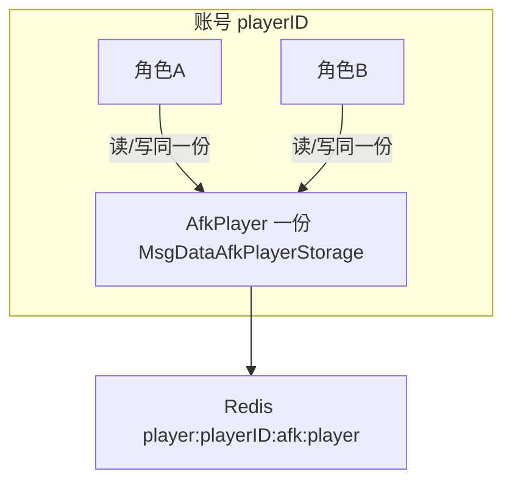

# 挂机绑定玩家（账号）、与角色无关 — 设计对齐计划

## 产品语义（本项目 · 已写入计划）

- **一个账号可有多个角色**；多角色在玩法上的定位是 **战斗表现**（进战、职业/造型等载体），**不是**挂机进度的分档维度。
- **挂机玩法归属「玩家」= 账号（`playerID`）**：进度、奖池、BOSS、通关领奖状态等 **全账号唯一一份**，任意当前登录角色看到的挂机状态应一致。

## 定稿（与实现对齐的结论）

- **挂机数据**：与 `**playerID`（账号）** 一份绑定。
- **同一账号下多个角色**：**共用同一份**挂机存储（你已选「shared」）；换角不改变挂机聚合根，仅可能影响「用当前角等级/条件做计算」等局部读参（见下表）。

## 现状（代码与需求）

- Redis Key：[key_constants.go](srv/game/domain/afk/entity/storage/key_constants.go) 为 `playerrole:{playerRoleId}:afk:player`，注释为**角色维度**。
- 存储模板：[afk_player_storage.go](srv/game/domain/afk/entity/storage/afk_player_storage.go) 内字段名 `playerRoleID` 参与 `GetRedisKey` / `GetEntityID`。
- 仓储：[afk_player_repository.go](srv/game/domain/afk/infrastructure/repository/afk_player_repository.go) `Load(ctx, playerRoleID)`。
- 《服务器需求》SR-4 / 709 行：写明 **每角色一份**、`playerrole:{playerRoleId}` — **与定稿冲突，必须改文档**。

## 目标架构（数据归属）

## 实现要点（按模块）

| 区域                                              | 变更方向                                                                                                                                                                        |
| ----------------------------------------------- | --------------------------------------------------------------------------------------------------------------------------------------------------------------------------- |
| Key                                             | 建议 `player:%d:afk:player`（与 [mining key](srv/game/domain/mining/entity/storage/key_constants.go) 等 `player:%d:*` 一致）                                                        |
| `AfkPlayerStorage`                              | 内部主键语义改为 **playerID**（可重命名字段为 `ownerPlayerID` 避免歧义）；`GetEntityID` 与 Template 一致                                                                                             |
| Repository / Registry                           | `GetOrCreate` / `Load` 参数改为 **playerID**；下线时按 **账号** 清理挂机 Registry 项（查现有 Domain 注册）                                                                                         |
| Handler                                         | 从 context 取 **playerID** 调 AppService；**当前角色 ID** 仍可取，用于下面「仍可能依赖角色」的逻辑                                                                                                      |
| `AdvanceAfkTimeAndDrops` / `BuildStatusPayload` | 掉落、展示等若依赖 **角色等级**：继续传 **当前 `playerRoleID` 对应的等级**（数据一份，计算用当前角）                                                                                                             |
| 解锁条件 `evalFirstMapUnlocked`                     | 确认策划语义：按 **账号** 还是 **当前角色** 判 `ConditionId`；若按账号，条件上下文需统一                                                                                                                   |
| **OfflinePopup**                                | 现读 **Role** 的 `LastLoginUnix`/`LastOfflineUnix`（角色维度）。定稿「挂机与角色无关」时，需单独定：**离线间隔**是否改为 **账号级字段**（可能要扩 `MsgDataPlayerStorage` 或等价）、或文档明确「仍用当前登录角色会话」——**避免产品与实现 silently 不一致** |
| **AfkBattleMapFinishHandler**                   | 现用主 `playerRoleID` 再 `GetOrCreate`；应改为 `**payload.PlayerID`** 加载挂机数据，避免换角进战读到错误实例                                                                                           |
| BDD / testutil                                  | 所有读 Redis `playerrole:*:afk:player` 的断言改为新 Key；可加 **同账号两角色拉 GetStatus 一致**（环境允许时）                                                                                           |
| 迁移                                              | 已有环境需把旧 Key 数据合并/迁移到 `player:`*，或工具脚本扫描 `playerrole:*:afk:player`                                                                                                           |

## 文档

- 更新 [G-挂机-服务器需求.md](docs/design/server/G-挂机/G-挂机-服务器需求.md) SR-4、K-1、与 OfflinePopup 相关 SR-4.1 段落。
- 更新 [G-挂机-开发文档.md](docs/design/server/G-挂机/G-挂机-开发文档.md) DD-2/存储说明。
- 更新 [domain/role/README.md](srv/game/domain/role/README.md) 中与「挂机只读 Role 会话」冲突的句子（若改为账号级会话则改写）。

## 风险

- **并发**：同账号多角色同时在线（若允许）可能对同一份 AFK 写冲突 — 依赖现有 WorkPool/串行策略是否按 **playerID** 分桶。
- **条件与等级**：「数据账号级、判级/判条件用当前角」需在评审中写清，避免策划误解。

---

**下一步**：若你确认执行本计划，再说「按该计划改代码」或「execute」；执行前建议与策划对表 **OfflinePopup 会话时间** 的最终归属。