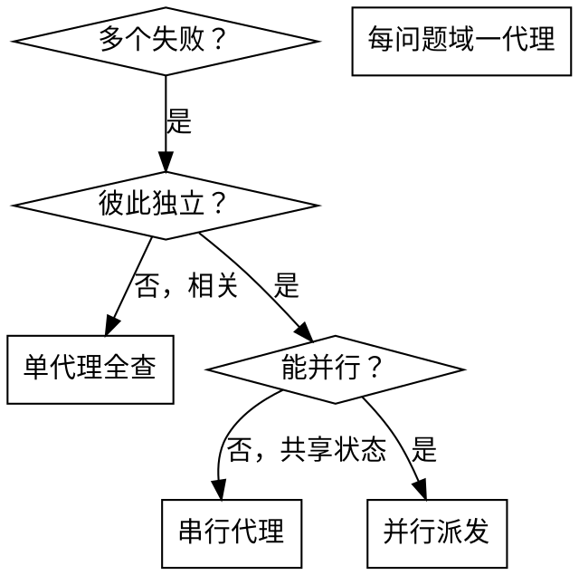

# 并行派发代理

## 概述

把任务交给专用代理，隔离上下文；精确编写其指令与上下文，使其专注完成。代理不应继承你会话里的历史——你只构造它需要的部分。这样也为你保留上下文做协调。

当多个**互不相关**的失败同时存在（不同测试文件、不同子系统、不同 bug），串行排查浪费时间；每项调查可并行。

**核心原则：** 每个独立问题域派一个代理；允许并发。

## 何时使用

**适合：**
- 3+ 个测试文件失败且根因不同
- 多个子系统独立损坏
- 每个问题可在不依赖其他上下文下理解
- 调查之间无共享状态

**不适合：**
- 失败彼此相关（修一个可能修一串）
- 需要理解完整系统状态
- 代理会互相干扰

## 模式

### 1. 划分独立域

按「坏了什么」分组，例如：
- 文件 A：工具审批流
- 文件 B：批处理完成行为
- 文件 C：中止功能

各域独立——修审批不一定影响中止测试。

### 2. 写聚焦的代理任务

每个代理获得：
- **范围：** 单测文件或子系统
- **目标：** 让这些测试通过
- **约束：** 不改无关代码
- **产出：** 根因与修改摘要

### 3. 并行派发

在支持 Task 的环境中同时对多个独立问题调用 Task，并发执行。

### 4. 汇总与合并

代理返回后：
- 阅读各摘要
- 确认修改无冲突
- 跑全量测试
- 合并所有变更

## 代理提示结构

好的提示应：
1. **聚焦** — 单一清晰问题域
2. **自包含** — 理解问题所需的上下文齐全
3. **明确产出** — 代理应返回什么？

**常见错误**

**❌ 太宽：**「修所有测试」— 代理会迷失  
**✅ 具体：**「修 agent-tool-abort.test.ts」

**❌ 无上下文：**「修竞态」— 不知道在哪  
**✅ 有上下文：** 粘贴错误信息与测试名

**❌ 无约束：** 可能大重构  
**✅ 有约束：**「不改生产代码」或「只改测试」

**❌ 产出模糊：**「修好」  
**✅ 产出：**「返回根因与变更摘要」

## 何时不要用

**相关失败：** 可能一修全好 — 先一起查  
**需要全局上下文**  
**探索性调试：** 还不清楚坏在哪  
**共享状态：** 会抢同一文件/资源

## 要点

1. **并行** — 多路调查同时进行  
2. **聚焦** — 每代理范围窄  
3. **独立** — 互不干扰  
4. **省时** — 三路问题可接近单路时间解决（若环境支持并行）

## 验证

代理返回后：
1. **读各摘要** — 了解改了什么  
2. **查冲突** — 是否改到同一处  
3. **全量测试** — 合并后仍绿  
4. **抽查** — 代理也可能系统性犯错

## 与真实工作流集成

多文件失败、根因独立时，按文件/子域拆分并行处理；合并前务必全量验证。
