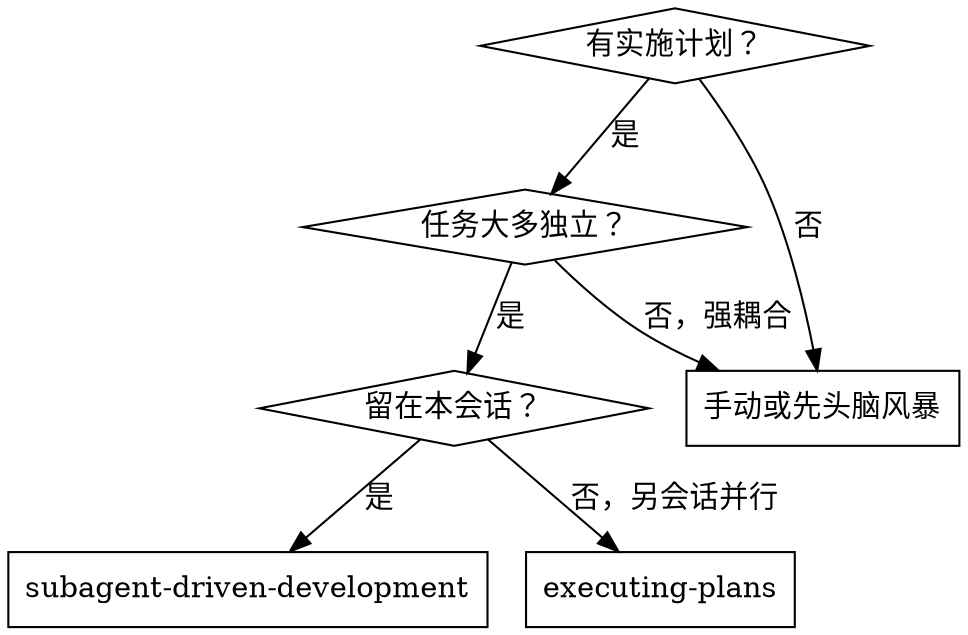

# 子代理驱动开发

按任务**派发全新子代理**执行 **`writing-plans` 产出的 BDD 实施计划**；每个任务后**两阶段评审**：先规格符合性，再代码质量。

**为何用子代理：** 隔离上下文、指令精确裁剪；子代理不应继承你的会话历史——你只给必要信息，也保留你的上下文做协调。

**核心原则：** 每任务新子代理 + 两阶段评审（规格→质量）= 高质量、快迭代。

## 何时使用

**相对 executing-plans：** 同会话、每任务新代理、每任务后两阶段评审、迭代更快。

## 流程（见同目录 dot 图）

每任务：**实现者**（`implementer-prompt.md`）→ **规格评审**（`spec-reviewer-prompt.md`）→ **质量评审**（`code-quality-reviewer-prompt.md`）→ Todo 完成。  
全部任务后：**最终代码评审** → **finishing-a-development-branch**。

## 模型选择

在能胜任的前提下选**最省**的模型：机械实现可用更快更便宜；整合与判断用标准；架构与评审用最擅长推理的。

信号：1–2 文件、规格完整 → 便宜；多文件整合 → 标准；需设计判断 → 最强。

## 实现者状态

- **DONE：** 进入规格评审。  
- **DONE_WITH_CONCERNS：** 先读顾虑；涉及正确性/范围先处理再评。  
- **NEEDS_CONTEXT：** 补信息再派。  
- **BLOCKED：** 补上下文 / 换更强模型 / 拆任务 / 计划错误则上升人类。  
**不要**无视升级或原样重试。

## 提示模板

- `./implementer-prompt.md`  
- `./spec-reviewer-prompt.md`  
- `./code-quality-reviewer-prompt.md`  

## 优势与成本

**优势：** 自然遵循测试先行（与 `test-driven-development` / 项目 BDD 一致）、上下文干净、可提问、双闸门（规格+质量）。  
**成本：** 每任务多次子代理调用；但早发现问题更省后期调试。

## 危险信号

**绝不：** 未经同意在 main/master 上开写；跳过任一评审；有未关闭问题就进下一任务；并行多个实现者抢同一批文件；让子代理自己读整份计划（应粘贴任务全文）；忽略子代理提问；规格未 ✅ 就做质量评审。

**评审发现问题：** 同实现者修 → 再评 → 循环至通过。

## 集成

**必选：** `using-git-worktrees`、`writing-plans`（**BDD 计划**）、`requesting-code-review`（模板）、`finishing-a-development-branch`。  
**子代理应遵循：** 任务中的 **BDD THEN**；代码实现可辅以 `test-driven-development`（红绿）与 `bdd.mdc` / **`bdd-qa`**。  
**替代路径：** `executing-plans` — 另会话执行时。
