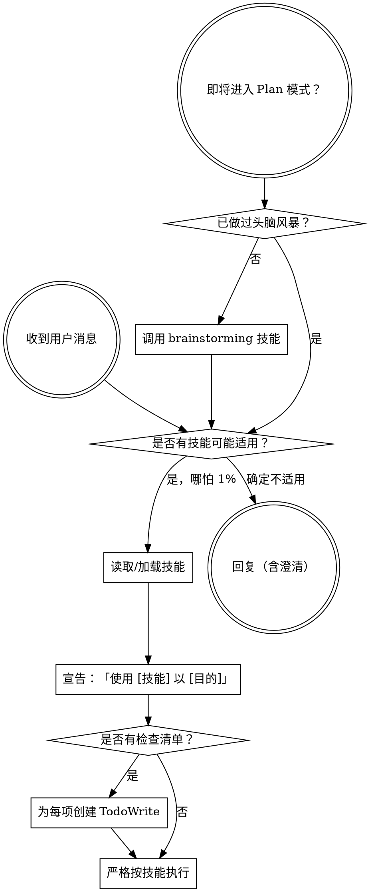

<SUBAGENT-STOP>
若你作为子代理被派发来执行具体任务，跳过本技能。
</SUBAGENT-STOP>

<EXTREMELY-IMPORTANT>
只要认为有哪怕 1% 的概率某技能适用于当前工作，就必须加载并遵循该技能。

若某技能适用于你的任务，你没有选择余地，必须使用。

不可协商、不可省略，不能自圆其说绕过。
</EXTREMELY-IMPORTANT>

## 套件名称

本仓库将这套流程与技能通称为 **Agents Team**（代理协作套件）。旧文档或社区资料中可能写作 **Superpowers**，或曾用名 **superstarts**，系同一套理念，以本仓库 `agents-team:` 引用为准。

## 指令优先级

Agents Team 技能会覆盖默认系统提示行为，但**用户显式指令始终优先**：

1. **用户显式说明**（`CURSOR.md`、`AGENTS.md`、`.cursor/rules`、直接要求）— 最高  
2. **Agents Team 技能** — 与默认系统行为冲突时以技能为准  
3. **默认系统提示** — 最低  

若用户写「不要用某类测试」而技能写「BDD 行为验收」，以用户说明为准；**实施计划**仍默认一律 BDD（Given-When-Then），除非用户明确豁免。

## 如何在 Cursor 中访问技能

**在 Cursor：** 通过 **Skills / 技能** 机制加载：当某技能适用时，用 **Read** 读取 `d:\server\.cursor\skills\<技能目录>\SKILL.md`（或依赖对话内已注入的技能列表），并**严格按正文执行**。不要跳过技能正文只靠记忆。

**其他 IDE 或 CLI：** 以各环境文档为准；工具名映射见 `references/codex-tools.md`、`references/gemini-tools.md`。

## 平台适配

上游技能原文可能写「Claude Code 工具名」— 在 Cursor 中对应 **编辑器侧工具**（读文件、终端、子代理 Task 等）。非 Cursor 平台见同目录 `references/` 下映射表。

# 使用技能

## 规则

**在作出任何回复或行动之前，先加载相关或被要求的技能。** 哪怕只有 1% 可能适用，也应加载确认。若加载后发现不适用，可不必按其执行。

## 危险信号

出现下列想法即应**停**——你在合理化：

| 想法 | 事实 |
|------|------|
| 「这只是个简单问题」 | 提问也是任务，要查技能。 |
| 「我需要先多要点上下文」 | 技能检查在澄清问题**之前**。 |
| 「我先扫一眼代码库」 | 技能告诉你**如何**探索；先查技能。 |
| 「我快速看下 git/文件就行」 | 文件没有对话上下文；先查技能。 |
| 「我先收集信息」 | 技能告诉你**如何**收集。 |
| 「这不需要正式技能」 | 若有对应技能，就要用。 |
| 「我记得这个技能」 | 技能会演进，要读当前版。 |
| 「这不算任务」 | 行动 = 任务，要查技能。 |
| 「用大炮打蚊子」 | 简单事也会变复杂，要用。 |
| 「我先干一件小事」 | **任何**事前都先检查技能。 |
| 「这样很有产出感」 | 无纪律的行动浪费时间，技能防这个。 |
| 「我懂那是什么意思」 | 懂概念 ≠ 已加载技能；要读 SKILL。 |

## 技能优先级

多个技能可能同时适用时，顺序如下：

1. **流程类优先**（brainstorming、debugging）— 决定**如何**切入任务  
2. **实现类其次**（frontend-design、mcp-builder 等）— 指导执行  

「我们做个 X」→ 先 brainstorming，再实现类技能。  
「修这个 bug」→ 先 systematic-debugging，再领域相关技能。

## 技能类型

**刚性**（测试先行、调试流程）：严格照做，不要为了「灵活」削弱纪律。  

**柔性**（模式）：原则可随上下文调整。  

以技能正文说明为准。

## 用户指令

用户说的是**做什么**（WHAT），不是**怎么做**（HOW）。「加 X」「修 Y」不代表可以跳过工作流。
